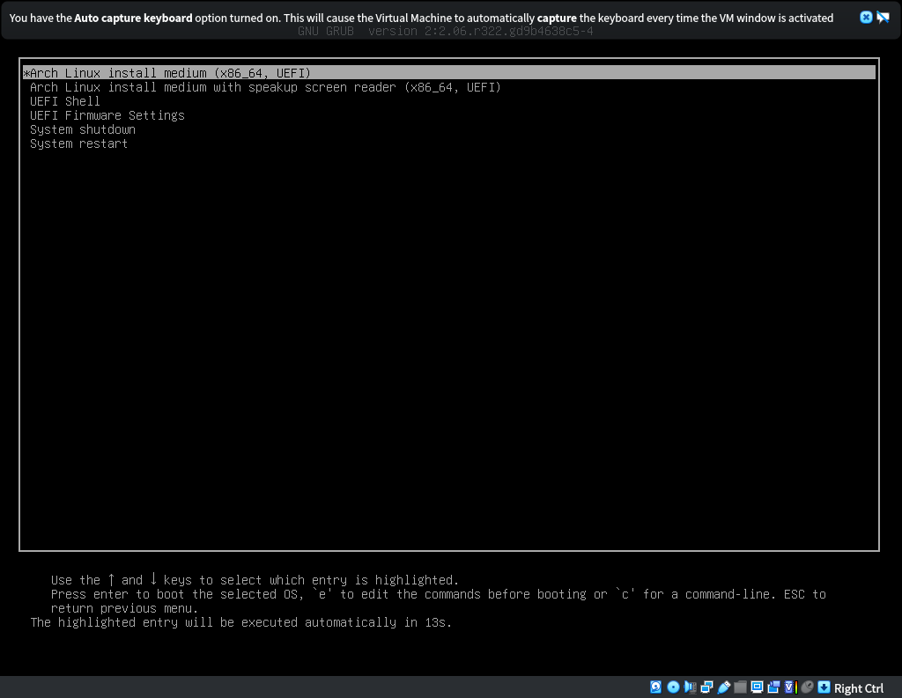
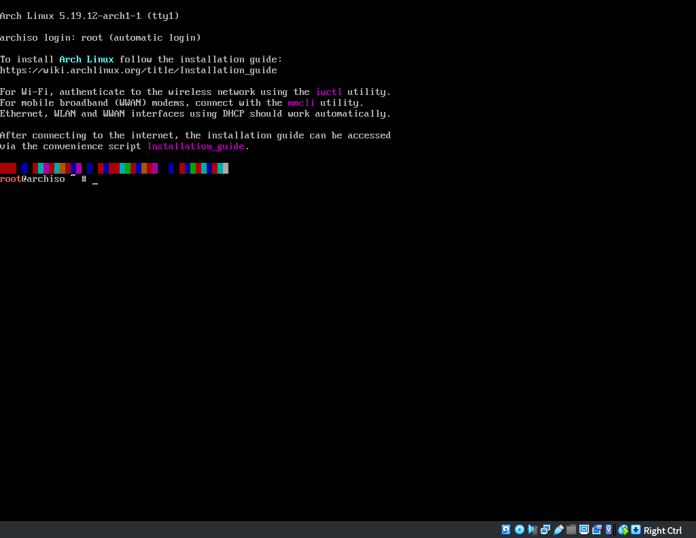
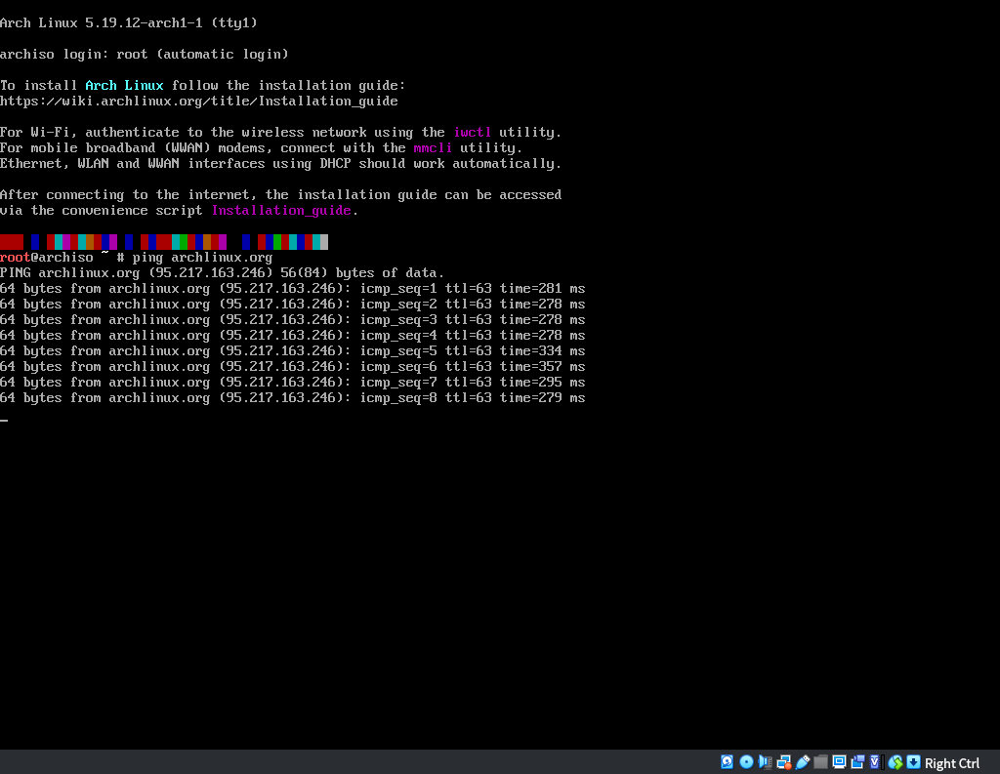
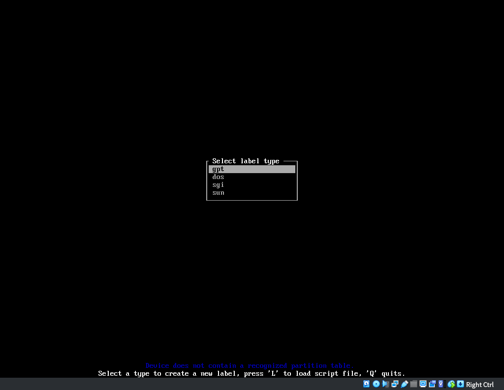
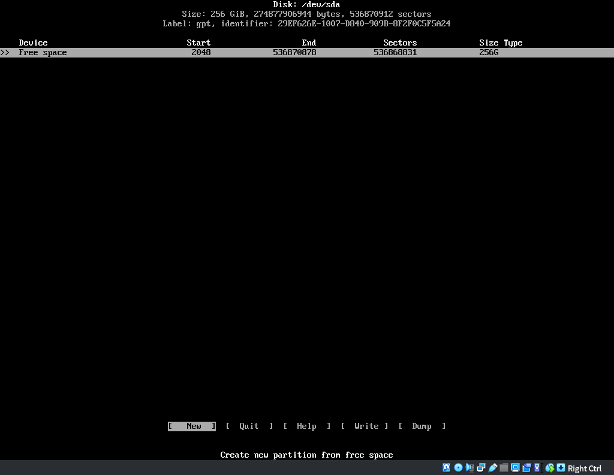
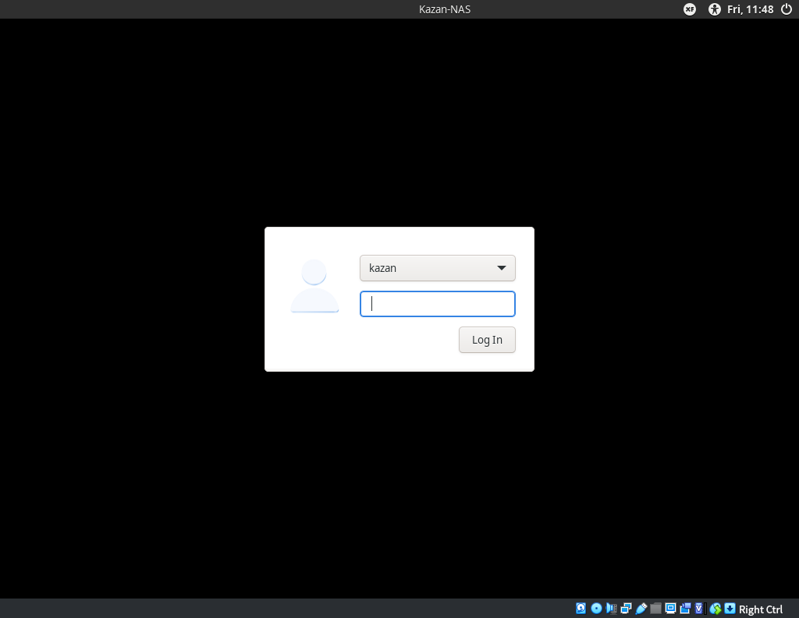
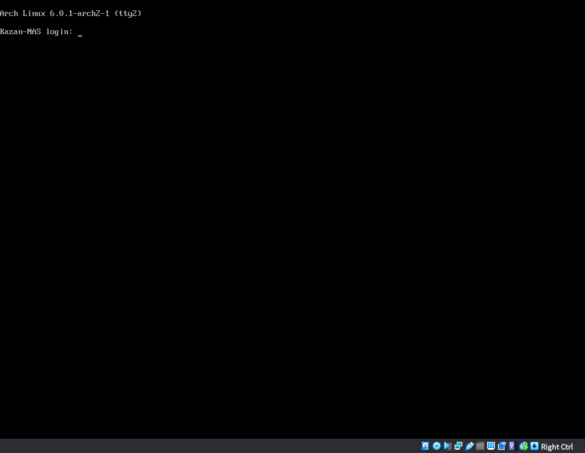
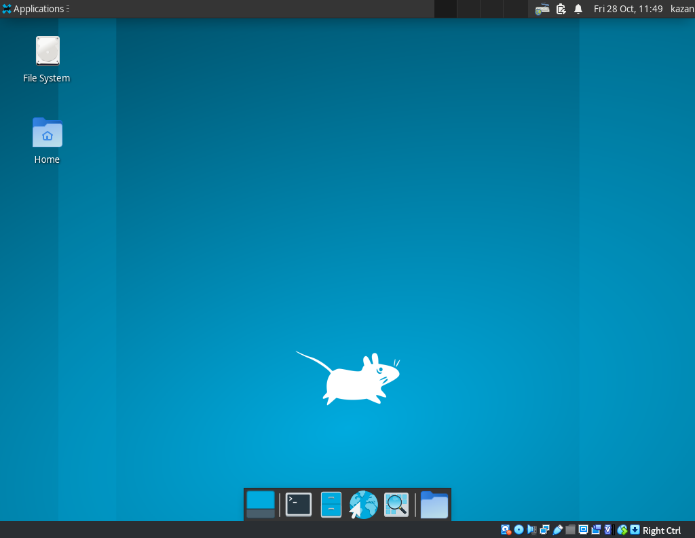

## 前情提要
Linux 有許多的發行版（distros），
而目前我所使用的發行版是 Debian Linux bookworm/sid，
儘管已經是非常新的版本，但還是免不了 Debian 的老毛病——套件老舊；
加之我準備在家裡架一台 server（不論是遠端主機或 NAS 都需要一台 server），需要更穩定而先進的作業系統，
經過考慮與比較（~~以及煩高秋~~）後決定改用目前使用者社群最大的 Arch Linux。

不過 Arch 一向被認為安裝很困難，
連 Arch Linux 台灣社群都明言安裝是最大的難關，甚至許多老手都常在裝機時遇上麻煩，
所以出現不少安裝指引的文章；
這次的文章一方面是提供安裝的一些提醒，一方面也是幫自己留下筆記，
那就讓我們來看看到底要如何安裝吧！

## Arch 的特點
Arch 有四大特點：
- 輕量
- 簡潔
- 社群活躍
- 漸進式升級

### 輕量
與其他發行板相比，Arch 並不預裝任何套件，這使得系統可以非常精簡（包含安裝映像都是），所以需要什麼都是由使用者自行決定。

### 簡潔
所有的函式庫、執行檔、文件、設定檔都有嚴格的路徑規範與系統管理，比較不會發生找不到設定檔的「迷路」狀況。

### 社群活躍
雖然絕大部分發行板都是由社群維護，但 Arch 的論壇與 Wiki 可以說是世界上最知名的開源社群，因為有著大量的使用者分享經驗與知識，這使得遇上問題時，Arch 使用者第一件事會是先去查論壇、Wiki。

### 漸進式升級
Arch 採用漸進式升級（rolling upgrade），這會使得套件每天都是最新的版本，也就是說你的 Arch 每天都是 latest wwww

（本段參考自 [Arch Linux 臺灣社群](https://archlinux.tw)）

## VM 設定
本次使用的是 Oracle VM VirtualBox，
相信大家最近應該都知道 VirtualBox 要大改版了，不過這不是今天的重點www
至於用 VM 練習安裝的好處我也不再贅述，直接進入設定吧：
1. 開啟 VirtualBox，選擇 "New" 以新增 VM。
2. 在 "Name" 打上一個名字，建議可以帶有 "arch" 字眼，VirtualBox 會自動將 "Type" 跟 "Version" 調整好。
3. Memory size 設定，建議至少 2 GB，但也需要考量到 Host 的記憶體大小，最好先用 `free -h` 檢查 MEM available，不要超過 available。
4. Hard disk 設定，這邊會設定你的虛擬硬碟，預設會是 "Create a virtual disk now" 也就是新增一個虛擬硬碟檔案，直接按下 "Create" 進入設定：
    - 首先會是選擇虛擬硬碟的檔案格式，建議使用預設的 VDI (VirtualBox Disk Image) 即可。
    - 接著是選擇在實體硬碟上的儲存方式，為了避免佔用過多硬碟空間，一般都會建議選用預設的 "Dynamically allocated"（動態定址），這個方式內部是使用 CoW（Copy on Write）實作，也就是在真正寫入一個區塊時才將 VDI 檔案增大並分配空間給 VM guest。
    - 接下來要選擇 VDI 檔案存放位置跟虛擬的硬碟大小，位置用預設就好，但大小很多人怕會佔用實體硬碟空間所以設定很小，但其實前一項才提到，VDI 配合 dynamically allocated 方式，實際上的檔案大小甚至不到 1 GB，所以大膽的給吧XD，我自己是給了 256 GB，因為太小的話屆時裝機分配給 root 的大小會不夠，就會導致後面即將提到的翻車事件……
5. 以上都設定完了之後，會在 VirtualBox 的 Manager 界面看到剛剛新增的 VM，但還不要高興，因為現在這樣仍然沒有開機媒體，是無法正常將 VM 「開機」的。
6. 請先準備好 Arch 的安裝碟映像檔（.iso），接著按下 VM 管理界面的 "Settings"，檢查並調整以下細節：
    - System
        - Motherboard
            - Extended Features: 請選擇 "Enable EFI (special OSes only)"
        - Processor
            - Processor(s): 4 CPUs，建議至少 2 CPUs
    - Display
        - Screen
            - Video Memory: 64 MB，不確定就用預設
    - Storage
        - Controller: IDE
            這裡是重點，預設會是 "Empty"，點選 "Empty"，並按下 "Optical Drive" 旁邊的小圖示，選擇事先準備好的 .iso 檔案，並勾選 "Live CD/DVD"。
7. 以上設定都沒有問題後，啟動 VM，進入以下畫面就代表設定成功，我們要開始裝機地獄囉（幹


## Arch 安裝
VM 啟動後，開機選單會有很多選項，直接選第一個就好；
接著等待以下畫面出現，就代表我們可以開始安裝了：


你可能會問：「怎麼是文字界面？所以我可以直接用了嗎？」或是「怎麼沒有跳出安裝指示？」，
這就是為什麼 Arch 被認為安裝很難的原因：**需要自己透過指令界面操作才能安裝系統，沒有圖形安裝界面。**
沒關係，接下來我會一步一步告訴大家該怎麼做！

### 網路測試
因為 Arch 的安裝映像是**最小安裝**，會需要網路下載所需套件，所以在開始之前一定要測試好網路連線。
使用 `ping` 指令測試網路功能：
```sh
ping archlinux.org
```
如果顯示如下圖，即可以按下 Ctrl+C 中斷並進入下一步：

這邊因為使用的是 VM，理論上網路連線不會有大問題，有的話就是你動到設定了（o

### 硬碟分割、格式化與掛載
安裝一個新系統最重要的就是分割硬碟跟格式化了！
***特別注意：檔案系統的格式會很大程度影響你的安裝與日後使用，特別是實機上務必謹慎操作！***

#### 分割
如果要分割硬碟，目前有很多種套件可以操作，最常見是用 `fdisk`，
但我個人喜歡用 `cfdisk`，因為有 UI 而且很直覺，且分割是以 size 而不是 sector 作為參考：
```sh
cfdisk
```

如上圖，選擇 "gpt" 後，顯示如下就可以開始分割：

用 "New" 並輸入磁碟大小以新增分割區，並且使用 "Type" 選擇檔案系統格式（很重要！），最後記得每個分割區都要用 "Write" 寫入，才不會做白工。

至於分割方式可以參考如下：
1. `/dev/sda1`：使用 EFI system，作為開機碟（`/boot`）使用，基本上給 256 MB 就足夠了，當然如果你的硬碟上本來就有開機磁區就可以略過。
2. `/dev/sda2`：使用 Linux Filesystem，作為根目錄（`/`）使用，**請務必給大一點以便能安裝套件**；因為是 VM 所以可以給更大一點，我會給到 128 GB。（分配太小會導致安裝套件時高機率發生裝不下，我曾經設了 16 GB 結果下面裝字體就硬碟塞爆了……）
3. `/dev/sda3`：使用 Linux Filesystem，預計會作為家目錄（`/home`）使用，先計算好下面的 Swap 空間，剩下就都留給這邊，我給了 123 GB。
4. `/dev/sda4`：使用 Linux swap，作為置換分區（Swap），類似 Windows 的 pagefile；當然如果 RAM 足夠可以不給，並且也可以在安裝完成後設定 swap file。這邊建議給跟記憶體大小差不多，我給了 4.7 GB。

#### 格式化
硬碟分割完成後，還需要格式化才能被識別，
首先格式化兩個主要的儲存碟為 `ext4` 格式：
```sh
mkfs.ext4 /dev/sda2
mkfs.ext4 /dev/sda3
```
接著要格式化開機碟為 `FAT32` 格式才能使用 EFI system 開機，當然如果本來就有就可以略過：
```sh
mkfs.fat -F 32 /dev/sda1
```
*提醒：這個指令的輸出只有顯示一行 `mkfs.fat` 的版本編號是正常的，不必擔心。*
然後格式化 swap：
```sh
mkswap /dev/sda4
```

#### 掛載
硬碟分割跟格式化之後，別忘了掛載到系統上才能被使用！
如果有出現找不到路徑的警告，就先 `mkdir -p <dir>` 建立目錄再回來掛載：
```sh
mount /dev/sda2 /mnt
mount /dev/sda3 /mnt/home
mount /dev/sda1 /mnt/boot
```
另外 swap 也要啟用：
```sh
swapon /dev/sda4
```

這些都做完了，終於要正式進入系統安裝的部份了！

### 設定套件來源鏡像
什麼又是設定？
沒事只差一步了不要緊張，這個沒有設定好就可能會看到美麗的 "request time out" 喔<3

為什麼要設定來源？簡單來說，今天我在台灣，但是套件從德國下載，你覺得下載套件會快嗎？
**當然慢到在地上爬啊別作夢了www**
所以設定優先順序還是非常重要的，
這邊有兩種方式提供，這次選用是用第二種：

#### 手動修改 mirrorlist
用官方提供的鏡像站列表，把在台灣的鏡像寫入 `/etc/pacman.d/mirrorlist` 並給予優先序，就這樣（？

#### 利用套件自動生成
可以利用 `reflector` 這個套件生成最佳排序：
```sh
# Install reflector
pacman -Sy reflector
# Generate mirrorlist
reflector --verbose -l 5 --sort rate --conutry 'Taiwan' --save /etc/pacman.d/mirrorlist
```

完成這些設定後，我們真的要開始執行「安裝」了。

### 安裝系統
#### 系統核心
首先要安裝基本的套件：
```sh
pacstrap /mnt base base-devel
```
這行指令會下載並安裝、建立基本系統架構。

接著是建立 fstab，
這個東西提供了 Linux 檔案系統的相關資訊，描述了儲存裝置及其相關磁區如何初始化，與掛載至整個系統，
所以非常重要！如果沒有設定好，之後開機肯定會噴掉：
```sh
genfstab -U /mnt >> /mnt/etc/fstab
```

然後，重頭戲來了：**切換至 chroot**。
`chroot` 是切換根目錄位置的指令，在這邊是要切換進入「未來」真正的檔案系統以進行設定，
並且 Arch 安裝時使用的是 `arch-chroot`，除了前述的動作還會帶入前置的設定：
```sh
arch-chroot /mnt
```
**提醒大家，`chroot` 指令要有目標路徑，不然不會動作喔！**
（~~我不會承認我在這邊因為忘記打翻車十幾次……~~）

切換到新系統之後，為了要讓這個系統成為一個可以獨立運作的作業系統，
我們要安裝對於所有 Linux 發行版而言最重要的東西——**Linux kernel**：
```sh
pacman -S linux
```
**特別注意：安裝核心務必在 chroot 內進行！**（~~我曾經在 chroot 外就下了安裝核心的指令，然後就翻車了ㄏㄏ~~）

#### 設定 root 與 user
一般來說一個 Linux 的系統裡面會有 root 與至少一個使用者（user），
在日常的使用、操作會以 user 身份進行，遇到重大系統操作才需要切換到 root 身份，
這是一種基本的系統安全。

首先我們設定 root 的密碼：
```sh
passwd
```
*提醒：大部分的終端機界面輸入密碼是什麼都不會顯示的，所以若你輸入後看到畫面上沒有任何字元不需要緊張喔！*

接著要啟用 sudo group，這是為了以後一般 user 可以進行套件安裝等日常操作：
```sh
visudo
```
找到類似下面這行，刪除 "#" 以取消註解：
```sh
# %wheel ALL=(ALL) ALL
```
（什麼你說你不會用 vim？~~STFG~~vim 教學網路上很多喔<3）

*注意：如果顯示錯誤「沒有 vim」，可以先安裝 vim 再重新執行：*
```sh
pacman -S vim
```

然後就是新增 user 並給予 sudo 權限：
```sh
# Add new user
useradd -m <username>
# Set user's password
passwd <username>
# Give user sudo
usermod <username> -aG wheel
```

#### 安裝開機管理程式
使用 UEFI 的話開機管理預設會使用 `systemd-boot`，但我喜歡用 GRUB，
所以要來安裝跟設定 GRUB 啦！

*注意：如果是實機，並且是 Intel/AMD 處理器的話，需要先下載 microcode，不過這次是 VM 就先略過了。*

首先當然是要下載所需套件：
```sh
pacman -S grub efibootmgr
```
接著安裝 grub：
```sh
grub-install --target=x86_64-efi --efi-directory=/boot --bootloader-id=GRUB
```
安裝好 GRUB 後，還要記得生成開機設定檔，屆時才會讓 Arch 出現在開機選單上：
```sh
grub-mkconfig -o /boot/grub/grub.cfg
```

#### 啟用網路連線功能
網路連線我個人習慣使用 `NetworkManager`，
並且我在這邊也翻車過一次，特別拿出來筆記一下。

```sh
pacman -S networkmanager
```
下載與安裝後，因為 NM 是個**服務**，需要在系統內啟用：
```sh
systemctl enable NetworkManager.service
systemctl start NetworkManager.service
```

到這邊其實你已經有一個堪用的 Arch Linux 了，
但大部分人還是習慣有圖形界面的桌面環境，所以接著就是來裝桌面環境吧！

### 桌面環境
在 Linux 上，一個堪用的桌面環境至少會有一個 DE 與 DM，
DE 是桌面環境，而 DM 則是~~廣告傳單~~桌面環境管理（Desktop Manager），
主流兩大 DE：GTK+ Gnome 跟 KDE plasma 都有自己的 DM，
但這次我打算使用的是輕量簡潔但已經具備基本桌面環境功能的 XFCE，
並且配合使用 LightDM 作為 DM。

#### 安裝 XFCE
XFCE 建議使用 X11 作為協定，所以除了 XFCE 的套件群組，還需要安裝 `xorg-server`：
```sh
pacman -S xorg-server
pacman -Sy xfce4
```

#### 安裝 LightDM
一個 DM 除了能執行桌面環境，還要有一些基本的登入登出功能，
這邊我使用推薦的 `lightdm-gtk-greeter`：
```sh
pacman -S lightdm lightdm-gtk-greeter
```
然後測試 LightDM 能不能正常運作：
```sh
systemctl start lightdm.service
```
如果有出現圖形登入界面如下代表應該可以正常運作，

先以 **user** 登入並直接關機。（右上角選單應該有 Shutdown 選項）

### 重新啟動測試
VM 關機後，可以先嘗試移除安裝媒體（映像檔）並再次啟動 VM，
如果開機選單有出現 "Arch Linux"，代表 Arch 安裝成功！
接著如果正常應該會是終端機登入界面如下圖：

此時先以 root 登入，並且正式啟用圖形界面：
```sh
systemctl enable lightdm.service
```
啟用之後重新啟動（`reboot`），應該就能看到登入界面囉！

### 環境設定
進入桌面環境後，先開啟終端機（這邊設定也可以先在上一步啟動 LightDM 前先設定），並設定以下資訊：
```sh
# Set timezone and NTP
sudo timedatectl set-timezone Asia/Taipei
sudo timedatectl set-ntp true
# Set locale
echo "en_US.UTF-8 UTF-8" >> /etc/locale.gen
echo "zh_TW.UTF-8 UTF-8" >> /etc/locale.gen
locale-gen
localectl set-locale en_US.UTF-8
# Set hostname
sudo hostnamectl set-hostname <your-host-name>
```
設定完成後可以「登出」再重新登入，理論上可以看到更動後的系統設定
*注意：關於語系的設定，也可以直接編輯 `/etc/locale.gen`，在裡面取消對應語系的註解即可。*

### 安裝中文輸入法與字體
如果需要中文輸入法與字體，需要額外安裝喔！

#### 輸入法
這邊我們使用 RIME：
```sh
# Install RIME and zhuyin-input-method
pacman -S ibus ibus-rime rime-bopomofo
# Set Ibus
ibus-setup
```
此時應該會跳出提示，確認後會跳出 Ibus 的設定視窗，
在 "Input method" 的 tab 內按下 "Add"，選擇 "Chinese"，並選擇 RIME；
然後在家目錄下新增一個檔案 `.xprofile`：
```
export GTK_IM_MODULE=ibus
export XMODIFIERS=@im=ibus
export QT_IM_MODULE=ibus
ibus-daemon -x -d
```
儲存後再次重啟，檢查輸入法有沒有 RIME 中文即可。

#### 字體
字體選用許多人都愛用的 Noto-fonts，並且中文 / 亞洲字體是 Noto-CJK，加上 emoji：
```sh
pacman -S noto-fonts noto-fonts-cjk noto-fonts-emoji
```
理論上登出再登入應該就可以使用了。

現在你應該得到一個非常基本的、可以方便操作的 Arch Linux 了，
剩下就是安裝你需要的套件，學習如何使用 Arch！

## 結論
本次文章跟安裝的過程，
大部份是參考了高手我朋友[繁嵐](https://www.fanlan.net)寫的[安裝筆記](https://www.fanlan.net/arch-linux-installation-note/index.html)，配合高秋每天被我~~騷擾~~討教，
終於在昨天成功的安裝到可以使用的狀態了（泣
裝了快兩週才終於成功一次，我真的佩服自己的毅力……

不過第一次嘗試這種安裝的模式其實很有趣，會更了解一點作業系統的架構與運作，
也有不少「意外之喜」，
相信之後裝 NixOS 肯定會有更多驚喜呢（棒讀

接下來，要來想我要用 Arch 做什麼事情，之後沒意外大概會有好幾篇文章在紀錄吧。
說不定明年鐵人賽主題就是這個了（幹

火山 / Kazan
2022.10.17